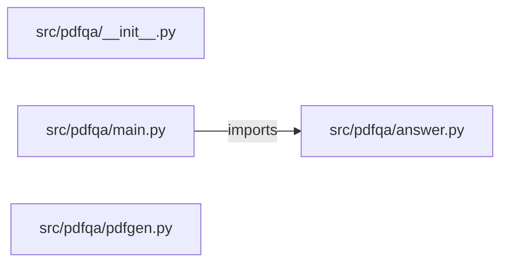

# pdf-qa-assistant — project architecture

[README](README.md) · [Interview questions and answers](INTERVIEW_QA.md)

## Purpose and scope

PDFs in `corpus/` and PDFs uploaded at runtime are split into pages and then sentences. A question is answered with the best matching sentence and a citation such as `runbook.pdf p.2`. A question that shares fewer than two meaningful words with every sentence is refused. No hosted model is called.

This document describes files and symbols in this checkout. Deployment templates and statements in the original overview are distinguished from a verified running environment.

## Component diagram



For Python repositories, arrows show resolved local imports, not network calls or deployment order. Otherwise the diagram is a repository component map; containment arrows do not assert runtime integration.

## Components and responsibilities

| Component | Responsibility |
| --- | --- |
| [`src/pdfqa/main.py`](src/pdfqa/main.py) | HTTP handlers: `GET /healthz`, `POST /ask`, `GET /documents`, `POST /documents` |
| [`src/pdfqa/pdfgen.py`](src/pdfqa/pdfgen.py) | Functions: `escape`, `build` |
| [`src/pdfqa/answer.py`](src/pdfqa/answer.py) | Functions: `unescape`, `stream_text`, `extract_pages`, `extract_pdf_text`, `load_corpus`, `documents`, `add_document` |
| [`requirements.txt`](requirements.txt) | Implementation or supporting configuration |
| [`src/pdfqa/__init__.py`](src/pdfqa/__init__.py) | Implementation or supporting configuration |
| [`tests/test_pdfqa.py`](tests/test_pdfqa.py) | Executable checks and regression examples |
| [`.github/workflows/ci.yml`](.github/workflows/ci.yml) | GitHub Actions job definitions |
| [`README.md`](README.md) | Project explanations or operating notes |

## Request interface

| Method and path | Handler | Source |
| --- | --- | --- |
| `GET /healthz` | `healthz` | [`src/pdfqa/main.py`](src/pdfqa/main.py#L9) |
| `POST /ask` | `post_ask` | [`src/pdfqa/main.py`](src/pdfqa/main.py#L14) |
| `GET /documents` | `list_documents` | [`src/pdfqa/main.py`](src/pdfqa/main.py#L22) |
| `POST /documents` | `post_document` | [`src/pdfqa/main.py`](src/pdfqa/main.py#L27) |

The table lists literal route decorators found in the inspected Python modules. Router prefixes and middleware can add behavior; check the linked handler and application setup before calling an endpoint.

## Implementation walkthrough

### `build(pages, compress=False)`

Source: [`src/pdfqa/pdfgen.py`](src/pdfqa/pdfgen.py#L10).

Return bytes of a valid PDF with one text line per list item on each page.

Calls visible in this function: `' '.join`, `''.join`, `body.encode`, `bytearray`, `bytes`, `enumerate`, `escape`, `f'<< /Length {len(data)}{extra} >>\nstream\n'.encode`, `f'<< /Type /Page /Parent 2 0 R /MediaBox [0 0 612 792] /Resources << /Font << /F1 3 0 R >> >> /Contents {content_id} 0 R >>'.encode`, `f'<< /Type /Pages /Kids [{kids}] /Count {count} >>'.encode`, `f'trailer\n<< /Size {len(objects) + 1} /Root 1 0 R >>\nstartxref\n{xref}\n%%EOF\n'.encode`, `f'xref\n0 {len(objects) + 1}\n0000000000 65535 f \n'.encode`.

```python
def build(pages, compress=False):
    """Return bytes of a valid PDF with one text line per list item on each page."""
    count = len(pages)
    kids = " ".join(f"{4 + 2 * i} 0 R" for i in range(count))
    objects = {
        1: b"<< /Type /Catalog /Pages 2 0 R >>",
        2: f"<< /Type /Pages /Kids [{kids}] /Count {count} >>".encode(),
        3: b"<< /Type /Font /Subtype /Type1 /BaseFont /Helvetica >>",
    }
    for index, lines in enumerate(pages):
        page_id, content_id = 4 + 2 * index, 5 + 2 * index
        objects[page_id] = (
            f"<< /Type /Page /Parent 2 0 R /MediaBox [0 0 612 792] "
            f"/Resources << /Font << /F1 3 0 R >> >> /Contents {content_id} 0 R >>"
        ).encode()
        body = "BT /F1 11 Tf 72 720 Td 14 TL\n" + "".join(f"({escape(line)}) Tj T*\n" for line in lines) + "ET"
        data = body.encode("latin-1")
        extra = ""
        if compress:
            data = zlib.compress(data)
            extra = " /Filter /FlateDecode"
        objects[content_id] = f"<< /Length {len(data)}{extra} >>\nstream\n".encode() + data + b"\nendstream"
```

The excerpt is truncated; the linked source contains the full implementation.

### `add_document(name, content_base64)`

Source: [`src/pdfqa/answer.py`](src/pdfqa/answer.py#L77).

Calls visible in this function: `DocumentError`, `NAME.match`, `base64.b64decode`, `data.startswith`, `extract_pages`, `isinstance`, `len`, `load_corpus`.

```python
def add_document(name, content_base64):
    if not isinstance(name, str) or not NAME.match(name):
        raise DocumentError("name must look like runbook.pdf: lowercase letters, digits, dash, underscore")
    if name in load_corpus():
        raise DocumentError("name is taken by a corpus document")
    if name not in UPLOADED and len(UPLOADED) >= MAX_DOCUMENTS:
        raise DocumentError(f"at most {MAX_DOCUMENTS} uploaded documents")
    try:
        data = base64.b64decode(content_base64 or "", validate=True)
    except (binascii.Error, TypeError) as exc:
        raise DocumentError("content_base64 is not valid base64") from exc
    if len(data) > MAX_BYTES:
        raise DocumentError(f"PDF is larger than {MAX_BYTES} bytes")
    if not data.startswith(b"%PDF-"):
        raise DocumentError("file does not start with %PDF-")
    pages = extract_pages(data)
    if not pages:
        raise DocumentError("no extractable text; a scanned PDF needs OCR first")
    UPLOADED[name] = pages
    return {"name": name, "pages": len(pages)}
```

### `answer(question, top_k=3)`

Source: [`src/pdfqa/answer.py`](src/pdfqa/answer.py#L120).

Calls visible in this function: `DocumentError`, `embed`, `hits.append`, `hits.sort`, `isinstance`, `len`, `passages`, `question.strip`, `round`, `sum`, `words`, `zip`.

```python
def answer(question, top_k=3):
    if not isinstance(question, str) or not question.strip():
        raise DocumentError("question is empty")
    if not isinstance(top_k, int) or not 1 <= top_k <= 10:
        raise DocumentError("top_k must be from 1 to 10")
    query_words = words(question)
    query = embed(question)
    hits = []
    for passage in passages():
        overlap = len(query_words & words(passage["text"]))
        score = sum(a * b for a, b in zip(query, embed(passage["text"])))
        hits.append({**passage, "overlap": overlap, "score": round(score, 4)})
    hits.sort(key=lambda hit: (hit["overlap"], hit["score"]), reverse=True)
    top = hits[:top_k]
    if not top or top[0]["overlap"] < 2:
        return {"answered": False, "answer": "No PDF passage is close enough.", "citation": None, "passages": top}
    best = top[0]
    return {"answered": True, "answer": best["text"], "citation": f"{best['source']} p.{best['page']}", "passages": top}
```

### `extract_pages(data)`

Source: [`src/pdfqa/answer.py`](src/pdfqa/answer.py#L47).

Calls visible in this function: `' '.join`, `' '.join((unescape(item) for item in LITERAL.findall(data))).strip`, `LITERAL.findall`, `STREAM.findall`, `enumerate`, `pages.append`, `stream_text`, `unescape`, `zlib.decompress`.

```python
def extract_pages(data):
    pages = []
    for header, body in STREAM.findall(data):
        if b"/FlateDecode" in header:
            try:
                body = zlib.decompress(body)
            except zlib.error:
                continue
        text = stream_text(body)
        if text:
            pages.append(text)
    if not pages:
        legacy = " ".join(unescape(item) for item in LITERAL.findall(data)).strip()
        if legacy:
            pages.append(legacy)
    return [(number, text) for number, text in enumerate(pages, start=1)]
```

## Validation and failure paths

| Explicit exception | Source |
| --- | --- |
| `DocumentError('name must look like runbook.pdf: lowercase letters, digits, dash, underscore')` | [`src/pdfqa/answer.py`](src/pdfqa/answer.py#L79) |
| `DocumentError('name is taken by a corpus document')` | [`src/pdfqa/answer.py`](src/pdfqa/answer.py#L81) |
| `DocumentError(f'at most {MAX_DOCUMENTS} uploaded documents')` | [`src/pdfqa/answer.py`](src/pdfqa/answer.py#L83) |
| `DocumentError(f'PDF is larger than {MAX_BYTES} bytes')` | [`src/pdfqa/answer.py`](src/pdfqa/answer.py#L89) |
| `DocumentError('file does not start with %PDF-')` | [`src/pdfqa/answer.py`](src/pdfqa/answer.py#L91) |
| `DocumentError('no extractable text; a scanned PDF needs OCR first')` | [`src/pdfqa/answer.py`](src/pdfqa/answer.py#L94) |
| `DocumentError('question is empty')` | [`src/pdfqa/answer.py`](src/pdfqa/answer.py#L122) |
| `DocumentError('top_k must be from 1 to 10')` | [`src/pdfqa/answer.py`](src/pdfqa/answer.py#L124) |
| `DocumentError('content_base64 is not valid base64')` | [`src/pdfqa/answer.py`](src/pdfqa/answer.py#L87) |
| `HTTPException(status_code=422, detail=str(exc))` | [`src/pdfqa/main.py`](src/pdfqa/main.py#L18) |
| `HTTPException(status_code=422, detail=str(exc))` | [`src/pdfqa/main.py`](src/pdfqa/main.py#L31) |

These are explicit exceptions in the inspected source, rather than a claim that every failure is handled. Follow the calling handler to see whether the exception becomes an HTTP response or propagates.

## Data and state

- [`src/pdfqa/answer.py`](src/pdfqa/answer.py) defines module-level containers: `STOP`, `ESCAPES`, `UPLOADED`.
- [`src/pdfqa/pdfgen.py`](src/pdfqa/pdfgen.py) defines module-level containers: `HANDBOOK`.

Module-level dictionaries/lists live in a Python process. They can be fixtures or mutable state; inspect writes before treating them as persistent storage. A production extension would need to define persistence and concurrency behavior explicitly.

## Data flow and design decisions

### What is the input-to-output contract of `build`

In [`src/pdfqa/pdfgen.py`](src/pdfqa/pdfgen.py#L10), `build(pages, compress=False)` receives the inputs. The function computes these intermediate values:

- `count = len(pages)`
- `kids = ' '.join((f'{4 + 2 * i} 0 R' for i in range(count)))`
- `objects = {1: b'<< /Type /Catalog /Pages 2 0 R >>', 2: f'<< /Type /Pages /Kids [{kids}] /Count {count} >>'.encode(), 3: b'<< /Type /Font /Subtype /Type1 /BaseFont /Helvetica >>'}`
- `out = bytearray(b'%PDF-1.4\n')`
- `offsets = {}`
- `xref = len(out)`

Its result is defined by:

- `bytes(out)`

### Which decision rules or boundary conditions should an interviewer challenge

The implementation in [`src/pdfqa/pdfgen.py`](src/pdfqa/pdfgen.py#L10) branches on:

- `compress`

A useful extension is a table-driven test that covers each condition just below, at, and above its boundary where applicable. These expressions are the current rules; changing them changes behavior and should be justified by the project’s acceptance criteria.

## Setup and verification

The following commands are derived from the checked-in dependency/test contracts. Execute them from the repository root; the block prepares a local environment, not a cloud deployment.

```bash
python3 -m venv .venv
source .venv/bin/activate
python -m pip install -r requirements.txt
python -m pytest -q
```

Python dependencies: [`requirements.txt`](requirements.txt).

Test entry points: [`tests/test_pdfqa.py`](tests/test_pdfqa.py).

Automation definitions: [`.github/workflows/ci.yml`](.github/workflows/ci.yml). Read their triggers and job steps to determine what CI actually runs.

## Operating boundaries and design review

Before turning this checkout into a customer deployment, establish the input contract, data ownership, access controls, failure response, evaluation criteria, and rollback owner. Repository fixtures and unit tests demonstrate local behavior; they do not establish throughput, uptime, compliance, or business impact.

A useful architecture review starts with the linked implementation: identify where input enters, where a decision is made, which state can change, and which external dependency can fail. Add a deployment view only for infrastructure that is actually configured and exercised.
